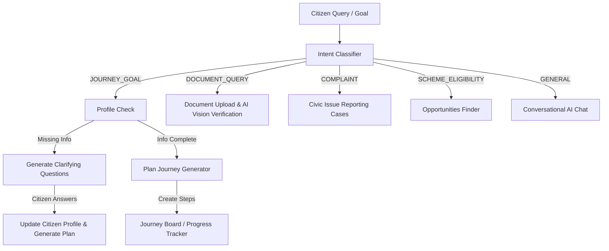

# BharatOS: Smart Bharat AI-Powered Civic Companion

BharatOS is a Generative AI-powered web platform designed to simplify access to government services, automate document verification, track civic complaints, and find eligible schemes for Indian citizens. By translating complex bureaucratic workflows into personalized, step-by-step "Journeys," BharatOS empowers users with a privacy-first, zero-login companion.

---

## 🎯 Chosen Vertical: Civic Companion & Rural/Urban Digital Inclusion
The project is built around the **General Citizen Services Companion & Digital Inclusion** vertical. It targets citizens who struggle to navigate disjointed, confusing government portals (e.g., MSME, UIDAI, passport, and agricultural departments). It translates a citizen's goal (e.g., "I want to start a dairy farm" or "I need to apply for a passport") into a structured, step-by-step journey, resolving digital literacy gaps in both urban and rural India.

---

## 🧠 GenAI Approach, Workflow & Strategy

BharatOS implements a multi-stage **GenAI Agent Workflow** to handle queries dynamically:



### 1. Intent Classification
The LLM evaluates incoming messages to determine the user's focus:
*   `JOURNEY_GOAL`: Steps to start businesses, acquire documents, or achieve civic goals.
*   `DOCUMENT_QUERY`: Uploading or questioning document prerequisites.
*   `COMPLAINT`: Grievances regarding civic infrastructure (roads, water, etc.).
*   `SCHEME_ELIGIBILITY`: Checking which government benefits apply.
*   `GENERAL`: Conversational questions.

### 2. Context-Aware Clarifying Questions
If a user requests a journey (e.g., starting a dairy business) but has no profile, the companion queries essential missing info (e.g., location, income, age, land ownership) in their language. This reduces user fatigue by asking only what's necessary.

### 3. AI-Powered Plan Generation (Journeys)
Once context is established, the agent generates structured tasks matching real Indian government processes, highlighting required documents (e.g., Aadhaar, Udyam Registration, or Land Records) for each step.

### 4. Document Intelligence (AI Vision Verification)
*   **The Problem:** Traditional document upload portals let users upload incorrect or expired files, leading to weeks of processing delays.
*   **The AI Solution:** BharatOS uses **Llama 3.2 Vision** (`llama-3.2-11b-vision-preview`) to analyze uploaded document images directly in the browser. It extracts the name, DOB, and ID numbers, checks them against the citizen's profile for discrepancies (names, age mismatch, etc.), and flags issues.
*   **Profile Auto-Fill:** Verified documents automatically update missing citizen profile fields (e.g., name, age), making the experience faster and smarter.

### 5. Multi-Scheme Opportunity Engine
The profile details are used by the AI to search a repository of Indian welfare programs (such as *PM Kisan*, *Mudra Loan*, *Jan Dhan Yojana*, *Ayushman Bharat*, etc.) and calculate estimated annual monetary benefits the citizen qualifies for.

---

## 🛠️ Technology Stack

*   **Frontend:** Next.js 16 (App Router), React 19, Tailwind CSS v4, Lucide Icons.
*   **Backend:** Next.js API Routes (Route Handlers), Server Actions.
*   **Database:** SQLite (local dev) / Postgres (production) via Prisma ORM.
*   **AI Models:**
    *   `llama-3.3-70b-versatile` (General chat, intent classification, clarifying questions, scheme recommendation)
    *   `llama-3.2-11b-vision-preview` (OCR and document intelligence/verification)
*   **Deployment:** Vercel + Neon Serverless Postgres.

---

## 🔒 Security & Privacy Features

*   **Privacy-First Session Tracking:** No email or password login is required. Sessions are stored using cryptographically random UUIDs in the client's session storage. Data is private and belongs strictly to the session.
*   **Preventing Injection & Attacks:** SQLite/Postgres database interactions are managed via Prisma ORM, which parameterized queries by default, protecting the backend from SQL injection.
*   **Safe AI Document Validation:** The server strictly verifies file MIME types and checks for image markers before sending base64 strings to the Groq Vision API, avoiding processing of dangerous external links.

---

## ⚙️ How to Run Locally

### Prerequisites
*   Node.js (v18+)
*   Git
*   Groq API Key (from [Groq Console](https://console.groq.com))

### Setup
1.  Clone the repository:
    ```bash
    git clone <repository-link>
    cd BharatOS
    ```
2.  Install dependencies:
    ```bash
    npm install
    ```
3.  Set up environment variables:
    Create a `.env` file from the example:
    ```bash
    cp .env.example .env
    ```
    Add your `GROQ_API_KEY` and set `DATABASE_URL=file:./data/dev.db`.
4.  Generate Prisma Client & Database Migration:
    ```bash
    npx prisma migrate dev --name init
    ```
5.  Start the development server:
    ```bash
    npm run dev
    ```
6.  Open [http://localhost:3000](http://localhost:3000) in your browser.

---

## 🧪 Testing

### Unit Tests (Vitest)
Unit tests validate schemas, prompt builders, language detectors, and AI document validation logic:
```bash
npm test
```

### End-to-End Tests (Playwright)
E2E tests ensure full user flows, including page transitions and input submissions:
```bash
npx playwright install
npm run test:e2e
```

---

## 💡 Assumptions Made

1.  **Session-based Citizen ID:** It is assumed that citizens prefer an anonymous service to check eligibility and plan processes rather than storing persistent, government-linked IDs (like Aadhaar card plaintext) permanently on a public DB.
2.  **Vision Availability:** The document verification flow assumes the user uploads clear images (JPEG/PNG) of their document. PDFs are handled with simulated fallback extraction using profile data.
3.  **Welfare Database:** Welfare schemes and estimated benefits are queried dynamically from the LLM based on realistic data models of active central/state schemes.
